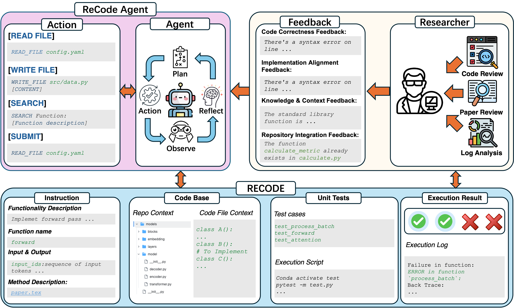

# RECODE-H: A Benchmark for Research Code Development with Interactive Human Feedback

<p align="center">
  <a href="https://arxiv.org/abs/2510.06186"></a>
  <a href="https://openreview.net/forum?id=IKnuyyPHCV"></a>
  
  
</p>

> Official implementation of **RECODE-H: A Benchmark for Research Code Development with Interactive Human Feedback**
>
> Chunyu Miao, Henry Peng Zou, Yangning Li, Yankai Chen, Yibo Wang, Fangxin Wang, Yifan Li, Wooseong Yang, Bowei He, Xinni Zhang, Dianzhi Yu, Hanchen Yang, Hoang H Nguyen, Yue Zhou, Jie Yang, Jizhou Guo, Wenzhe Fan, Chin-Yuan Yeh, Panpan Meng, Liancheng Fang, Jinhu Qi, Wei-Chieh Huang, Zhengyao Gu, Yuwei Han, Langzhou He, Yuyao Yang, Yinghui Li, Hai-Tao Zheng, Xue Liu, Irwin King, Philip S. Yu

---

## Overview

**RECODE-H** is a benchmark designed to evaluate LLMs on *research code development* — the task of generating correct, executable implementations of algorithms from ML research papers, with iterative refinement driven by structured human-like feedback.

While LLMs show promise in supporting scientific research implementation, their ability to generate correct and executable research code remains limited. RECODE-H addresses this gap with:

- **102 tasks** sourced from ML research papers (NeurIPS/ICML/ICLR 2023–2025), each requiring implementation of a non-trivial algorithm or module verified by unit tests
- **ReCodeAgent**, a multi-turn agent framework that iteratively refines code based on test execution results and structured feedback
- A **five-level feedback hierarchy** (L0–L4) that controls how much guidance the agent receives per turn — from no feedback to direct code corrections — enabling fine-grained study of feedback granularity
- Evaluation across **GPT-4.1, Claude Sonnet 4, DeepSeek-V3, Gemini 2.5**, and other frontier models

Key finding: richer feedback yields substantial performance gains, but generating complex research code remains an open challenge even for state-of-the-art models.

---

## System Design

<p align="center">
  
</p>

The framework consists of two interacting agents:

**CodeAgent** — an LLM-powered agent that iteratively edits code using tool actions (view file, edit function, run tests, submit). It maintains a conversation history with automatic memory summarization across feedback turns.

**HumanAgent** — runs pytest against the generated code, analyzes failures against the canonical solution, and generates structured feedback at the configured guidance level using a reasoning model (e.g., o4-mini).

### Five-Level Feedback Hierarchy

| Level | Content delivered to CodeAgent |
|-------|-------------------------------|
| **L0** | No feedback — test pass/fail count only |
| **L1** | Which interface failed + brief error description |
| **L2** | L1 + root cause analysis of the failure |
| **L3** | L2 + actionable suggestions for fixing the code |
| **L4** | L3 + direct code correction (most informative) |

Feedback follows a structured 4-field schema per error: `interface → description → analysis → actionable_feedback → direct_code_feedback`, with fields selectively revealed according to the level.

### Evaluation Settings

| Setting | Description |
|---------|-------------|
| `baseline` | One-shot LLM generation per turn, no tool use |
| `agent` | Tool-use agent (view/edit/submit actions), no cross-turn memory |
| `memory_agent` | Tool-use agent with persistent cross-turn memory (primary setting) |

---

## Repository Structure

```
.
├── agent/                            # Core ReCodeAgent implementation
│   ├── research_code_generation.py   # Main experiment entry point
│   ├── agents.py                     # CodeAgent and HumanAgent classes
│   ├── action.py                     # Tool action definitions (view, edit, submit, ...)
│   ├── inference.py                  # Unified LLM API wrapper (OpenAI/Anthropic/Gemini/...)
│   ├── constants.py                  # System prompts and prompt templates
│   ├── utils.py                      # Dataset I/O and result utilities
│   ├── tools.py                      # Tool utilities
│   ├── common_imports.py             # Shared imports
│   ├── clean_test_runner.py          # Isolated pytest runner (no conda activate side-effects)
│   └── env_cache.py                  # Conda environment fingerprinting and caching
├── ablation/                         # Ablation and analysis scripts
│   ├── feedback_ablation.py          # Guidance level ablation
│   ├── human_feedback.py             # Human vs. LLM feedback comparison
│   ├── feedback_category.py          # Feedback category analysis
│   └── step_ablition.py              # Step-level replay analysis
├── scripts/                          # Environment and dataset utilities
│   ├── manage_envs.py                # Pre-build all benchmark conda environments
│   ├── extract_env_map.py            # Extract task-to-environment mapping
│   └── verify_envs_via_test_sh.py    # Sanity-check environments via canonical solutions
├── retrieval/                        # Code retrieval module (RAG over paper repos)
├── metrics/                          # Evaluation metric scripts
│   ├── metric_passrate_testcase.py   # Test-case pass rate (primary metric)
│   ├── metric_passrate_unitest.py    # Unit test pass rate
│   ├── metric_codebleu.py            # CodeBLEU
│   ├── metric_codebert.py            # CodeBERT similarity
│   ├── metric_MRR.py                 # Mean Reciprocal Rank
│   └── metric_huamfeedback.py        # Human feedback quality metric
├── config/
│   └── default.yaml                  # Single config template (all fields documented)
├── work_dir/                         # Benchmark dataset root
│   └── dataset/
│       ├── annotation_meta.jsonl     # Task metadata (index, test cases, file paths, ...)
│       └── annotations/
│           └── annotation_<id>/      # Per-task workspace
│               ├── instruction.txt   # Natural language task description
│               ├── <repo>/           # Research paper's code repository
│               ├── canonical.py      # Reference implementation (not shown to agent)
│               ├── test.py           # Unit tests
│               └── test.sh           # Test runner script
├── install_all_benchmark_envs.sh     # One-shot environment installer
├── requirements.txt
└── README.md
```

---

## Setup

### 1. Clone and Install

```bash
git clone https://github.com/ChunyuMiao98/RECODE.git
cd RECODE
```

Python **3.10** is recommended.

```bash
conda create -n recode python=3.10 -y
conda activate recode
pip install -r requirements.txt
```

### 2. Download Dataset

The benchmark dataset (~7.7 GB, 102 tasks) is hosted on HuggingFace:

```bash
huggingface-cli download mcy98/RECODE-H \
  --repo-type dataset \
  --local-dir work_dir/dataset
```

This will populate `work_dir/dataset/` with `annotation_meta.jsonl` and all per-task `annotations/` directories.

### 3. Build Task Environments

Each benchmark task executes inside its own conda environment to satisfy the paper-specific dependencies. Build all environments at once:

```bash
bash install_all_benchmark_envs.sh
```

To verify that the environments are correctly set up (runs the canonical solution against each task's unit tests and checks for passes):

```bash
# Smoke test on 5 tasks
python scripts/verify_envs_via_test_sh.py \
  --dataset-dir work_dir/dataset \
  --task-ids 1,2,3,4,5

# Full verification across all tasks
python scripts/verify_envs_via_test_sh.py \
  --dataset-dir work_dir/dataset
```

### 4. Configure API Keys

Copy the default config and fill in your credentials:

```bash
cp config/default.yaml config/my_config.yaml
# Edit config/my_config.yaml with your API keys and model choices
```

The key fields to set:

```yaml
# Code generation model
api-key: "YOUR_API_KEY"
api-provider: "anthropic"           # openai | anthropic | gemini | azure-openai | together
model: "claude-sonnet-4-20250514"

# Feedback model (HumanAgent) — recommend a reasoning model
human-api-key: "YOUR_API_KEY"
human-api-provider: "openai"
human-agent-model: "o4-mini"

# Experiment settings
evaluation-setting: "memory_agent"  # baseline | agent | memory_agent
guidance-level: 4                   # 0–4 (see feedback hierarchy above)
max-turn: 10
max-steps: 3
```

See `config/default.yaml` for the full list of options with detailed descriptions.

---

## Running Experiments

All commands run from the repository root.

### Run the Main Experiment

```bash
python agent/research_code_generation.py \
  --yaml-location config/my_config.yaml \
  --max-workers 4 \
  --parallel-mode processes
```

| `--parallel-mode` | Description |
|-------------------|-------------|
| `processes` (recommended) | Process-based parallelism — avoids GPU memory lock issues that occur with threads |
| `threads` | Thread-based parallelism — may cause GPU memory lock contention, not recommended |
| `none` | Sequential — useful for debugging |

Results are written to:
```
experiment_results/<setting>_<model>_feedback_<type>_guidance_<level>/task_<id>_result.pkl
```

### Sweep All Guidance Levels (L0–L4)

To reproduce the main ablation from the paper, run all five guidance levels for a model:

```bash
for level in 0 1 2 3 4; do
  # Edit guidance-level in your config, or use per-level configs
  sed "s/guidance-level:.*/guidance-level: $level/" config/my_config.yaml \
    > config/tmp_level${level}.yaml
  python agent/research_code_generation.py \
    --yaml-location config/tmp_level${level}.yaml \
    --max-workers 4 \
    --parallel-mode processes
done
```

### Run a Subset of Tasks

Add to your YAML config:

```yaml
task-ids: [1, 5, 12, 42]
```

---

## Evaluation

All metric scripts run from the repository root and read from `experiment_results/`.

### Test-Case Pass Rate (primary metric)

Measures the fraction of unit test cases passed across tasks:

```python
import sys
sys.path.insert(0, "metrics")
from metric_passrate_testcase import get_model_passrates, load_task_ids_from_jsonl

task_ids = load_task_ids_from_jsonl("work_dir/dataset/annotation_meta.jsonl")

# Returns a list of pass rates for guidance levels [0, 1, 2, 3, 4]
rates = get_model_passrates(
    model="claude-sonnet-4-20250514",
    task_ids=task_ids,
    result_dir="experiment_results"
)
print(rates)  # e.g. [0.21, 0.31, 0.38, 0.44, 0.49]
```

### Per-Turn Pass Rate

Tracks how the pass rate evolves across feedback turns:

```python
from metric_passrate_testcase import get_model_passrates_turn

turn_rates = get_model_passrates_turn(
    model="claude-sonnet-4-20250514",
    task_ids=task_ids
)
```

### CodeBLEU

```bash
python metrics/metric_codebleu.py
```

### CodeBERT Similarity

```bash
python metrics/metric_codebert.py
```

### Run a Single Task's Tests (debugging)

```bash
python agent/clean_test_runner.py \
  --work-dir work_dir \
  --task-id 1 \
  --timeout-sec 600
```

Report written to `work_dir/dataset/annotations/annotation_1/pytest_report/report.xml`.

---

## Ablation Experiments

### Feedback Guidance Level Ablation

Reproduces the L0–L4 comparison from the paper:

```bash
python ablation/feedback_ablation.py --yaml-location config/my_config.yaml
```

### Human vs. LLM Feedback

Compares LLM-generated feedback against human-written feedback:

```bash
python ablation/human_feedback.py --yaml-location config/my_config.yaml
```

### Feedback Category Analysis

Analyzes the distribution of feedback categories (logic errors, API misuse, etc.):

```bash
python ablation/feedback_category.py --yaml-location config/my_config.yaml
```

---

## Supported Models

| Provider | Models |
|----------|--------|
| Anthropic | Claude Sonnet 4, Claude Opus 4 |
| OpenAI | GPT-4o, GPT-4.1, GPT-4.1-mini, o4-mini |
| Google | Gemini 2.0 Flash, Gemini 2.5 Pro |
| DeepSeek | DeepSeek-V3 |
| Meta (via Together AI) | LLaMA 3.1/3.3 70B Instruct |

---

## Citation

If you use RECODE-H in your research, please cite:

```bibtex
@article{miao2025recodeh,
  title   = {RECODE-H: A Benchmark for Research Code Development with Interactive Human Feedback},
  author  = {Chunyu Miao and Henry Peng Zou and Yangning Li and Yankai Chen and Yibo Wang and
             Fangxin Wang and Yifan Li and Wooseong Yang and Bowei He and Xinni Zhang and
             Dianzhi Yu and Hanchen Yang and Hoang H Nguyen and Yue Zhou and Jie Yang and
             Jizhou Guo and Wenzhe Fan and Chin-Yuan Yeh and Panpan Meng and Liancheng Fang and
             Jinhu Qi and Wei-Chieh Huang and Zhengyao Gu and Yuwei Han and Langzhou He and
             Yuyao Yang and Yinghui Li and Hai-Tao Zheng and Xue Liu and Irwin King and
             Philip S. Yu},
  journal = {arXiv preprint arXiv:2510.06186},
  year    = {2025},
  url     = {https://arxiv.org/abs/2510.06186}
}
```

---

## License

This project is licensed under the MIT License.
